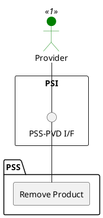

=begin

# TOD-05-03-03-Remove_Product

> The heading has to be included in the document including this document.

=end

{#fig:TOD-05-03-03-Remove_Product}

**Prerequisites**

The product exists in the PSS datastore.

**Main operation**

Removes a product either by deleting it or indicating it is no longer valid, via a standard interface.

**REST Endpoints**

@include [TOD-05-03-03 Remove Product Endpoints](endpoints/TOD-05-03-03-Remove_Product-endpoints.md)

**Post Conditions**

The product is successfully deleted or indicated it is no longer valid in the PSS datastore.

**Applicable Requirements**

@include [TOD-05-03-03 Remove Product Requirements](requirements/TOD-05-03-03-Remove_Product-requirements.md)

**eTOM Reference**

The operation is based on the 1.2.11 process identifier from the eTOM.
