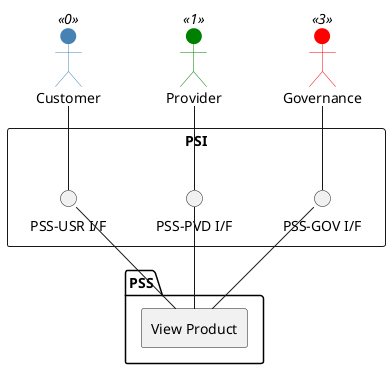

=begin

# TOD-05-03-04-View_Product

> The heading has to be included in the document including this document.

=end

{#fig:TOD-05-03-04-View_Product}

**Prerequisites**

The product exists in the PSS datastore.

**Main operation**

Gets a product with a specific identifier via a standard interface.
Customers can only see the products they booked and providers can only see the products they have created.

**REST Endpoints**

@include [TOD-05-03-04 View Product Endpoints](endpoints/TOD-05-03-04-View_Product-endpoints.md)

**Post Conditions**

The product is successfully returned to be viewed.

**Applicable Requirements**

@include [TOD-05-03-04 View Product Requirements](requirements/TOD-05-03-04-View_Product-requirements.md)

**eTOM Reference**

The operation is based on the 1.2.11 process identifier from the eTOM.
