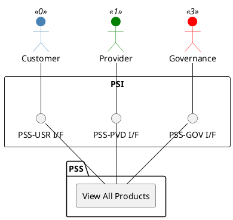

=begin

# TOD-05-03-05-View_All_Products

> The heading has to be included in the document including this document.

=end

{#fig:TOD-05-03-05-View_All_Products}

**Prerequisites**

Products exist in the PSS datastore.

**Main operation**

Gets all products via a standard interface.
Customers can only see the products they booked.

**REST Endpoints**

@include [TOD-05-03-05 View All Products Endpoints](endpoints/TOD-05-03-05-View_All_Products-endpoints.md)

**Post Conditions**

All visible products are successfully returned to be viewed.

**Applicable Requirements**

@include [TOD-05-03-05 View All Products Requirements](requirements/TOD-05-03-05-View_All_Products-requirements.md)

**eTOM Reference**

The operation is based on the 1.2.11 process identifier from the eTOM.
