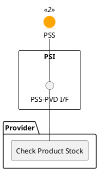

=begin

# TOD-05-04-01-Check_Product_Stock

> The heading has to be included in the document including this document.

=end

{#fig:TOD-05-04-01-Check_Product_Stock}

**Prerequisites**

At least one Product Specification must be known.

**Main operation**

The customer selects an on-demand product they found via matchmaking in the PSS.
Since the availability is unknown to the system, it sends a request to the provider to check it.
It contains the following information:

* *instantSyncCheck* - Whether the result should be returned as part of the response.
  If false, the action is created on the provider side and can be fetched later.
* *provideAlternative* - Whether the provider is allowed to return alternatives if the product is not available.
* *requestedAvailabilityStart* / *requestedAvailabilityEnd* - The time interval where the product is to be booked.
  Usually equal to the interval defined in the inquiry.
* *checkProductStockItem* - A list of product specifications for which the availability is requested.
  Each one also contains the characteristics the stocked product shall have.
  If a characteristic is not listed, it is irrelevant for the check.

The action is created via the `POST` endpoint and will get a unique ID by the server.
The result is written to the `availabilityResult` field of each requested item, indicating whether it is available, unavailable or alternatives are provided in the `alternate` field.
Though the `instantSyncCheck` signals the expectation of the client, the server can **always** return two status codes which have to be handled appropriately (e.g. by visualising it to the customer):

* Code `200` means that the result is available immediately in the first response.
* Code `201` means that the result can be fetched later via the `GET` endpoint using the ID.

**REST Endpoints**

@include [TOD-05-04-01-Check_Product_Stock Endpoints](endpoints/TOD-05-04-01-Check_Product_Stock-endpoints.md)

**Post Conditions**

The action is created on the provider system.
Depending on the return code, the result is available immediately or after a delay.

**Applicable Requirements**

@include [TOD-05-04-01-Check_Product_Stock Requirements](requirements/TOD-05-04-01-Check_Product_Stock-requirements.md)

**eTOM Reference**

The operation is based on the 1.5.4.6 and 1.6.8.2 processes identifier from the eTOM.
