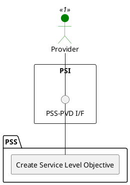

=begin

# TOD-06-01-01-Create_Service_Level_Objective

> The heading has to be included in the document including this document.

=end

{#fig:TOD-06-01-01-Create_Service_Level_Objective}

**Prerequisites**

The service level objective does not exist in the PSS datastore.

**Main operation**

Creates a new service level objective instance via a standard interface.

Some properties of a service level objective are:

* *name* - Short name of the service level objective
* *validFor* - The validity of the service level objective
* *keyIndicator* - The service level indicator (SLI) used for this SLO
* *threshold* - A list of thresholds that applies to this objective
* *toleranceTarget* - Indicating the allowable variation of a compliance goal within the tolerance period
* *tolerancePeriod* - Defines the period for the applicability of the tolerance target
* *applicability* - The applicability of the SLO in relation to the schedule

**REST Endpoints**

@include [TOD-06-01-01 Create Service Level Objective](endpoints/TOD-06-01-01-Create_Service_Level_Objective-endpoints.md)

**Post Conditions**

The service level objective is successfully created in the PSS datastore.

**Applicable Requirements**

@include [TOD-06-01-01 Create Service Level Objective](requirements/TOD-06-01-01-Create_Service_Level_Objective-requirements.md)

**eTOM Reference**

The operation is based on the 1.4.7 process identifier from the eTOM.
