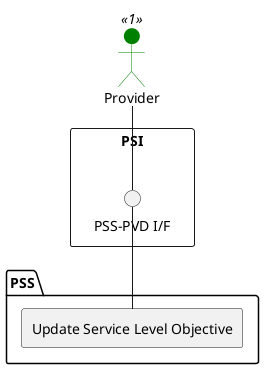

=begin

# TOD-06-01-01-Update_Service_Level_Objective

> The heading has to be included in the document including this document.

=end

{#fig:TOD-06-01-02-Update_Service_Level_Objective}

**Prerequisites**

The service level objective exists in the PSS datastore.

**Main operation**

Updates an existing service level objective instance via a standard interface.

**REST Endpoints**

@include [TOD-06-01-02 Update Service Level Objective](endpoints/TOD-06-01-02-Update_Service_Level_Objective-endpoints.md)

**Post Conditions**

The service level objective is successfully updated in the PSS datastore.

**Applicable Requirements**

@include [TOD-06-01-02 Update Service Level Objective](requirements/TOD-06-01-02-Update_Service_Level_Objective-requirements.md)

**eTOM Reference**

The operation is based on the 1.4.7 process identifier from the eTOM.
