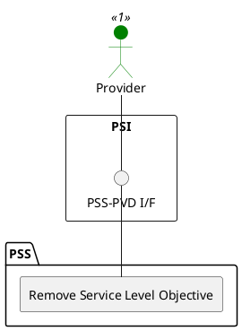

=begin

# TOD-06-01-01-Remove_Service_Level_Objective

> The heading has to be included in the document including this document.

=end

{#fig:TOD-06-01-03-Remove_Service_Level_Objective}

**Prerequisites**

The service level objective exists in the PSS datastore.

**Main operation**

Removes a service level objective instance either by deleting it or indicating it is no longer valid, via a standard interface.

**REST Endpoints**

@include [TOD-06-01-03 Remove Service Level Objective](endpoints/TOD-06-01-03-Remove_Service_Level_Objective-endpoints.md)

**Post Conditions**

The service level objective is successfully deleted or indicated it is no longer valid in the PSS datastore.

**Applicable Requirements**

@include [TOD-06-01-03 Remove Service Level Objective](requirements/TOD-06-01-03-Remove_Service_Level_Objective-requirements.md)

**eTOM Reference**

The operation is based on the 1.4.7 process identifier from the eTOM.
