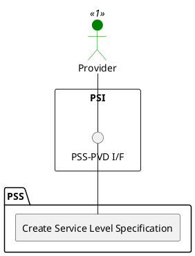

=begin

# TOD-06-02-01-Create_Service_Level_Specification

> The heading has to be included in the document including this document.

=end

{#fig:TOD-06-02-01-Create_Service_Level_Specification}

**Prerequisites**

The service level specification does not exist in the PSS datastore and referenced service level objectives are available.

**Main operation**

Creates a new service level specification instance via a standard interface.

Some properties of a service level specification are:

* *name* - Short name of the service level specification
* *description* - A brief introduction of the service level specification
* *relatedServiceLevelObjective* - A list of objectives belonging to this service level specification
* *validFor* - The validity of the service level specification

**REST Endpoints**

@include [TOD-06-02-01 Create Service Level Specification](endpoints/TOD-06-02-01-Create_Service_Level_Specification-endpoints.md)

**Post Conditions**

The service level specification is successfully created in the PSS datastore.

**Applicable Requirements**

@include [TOD-06-02-01 Create Service Level Specification](requirements/TOD-06-02-01-Create_Service_Level_Specification-requirements.md)

**eTOM Reference**

The operation is based on the 1.4.7 process identifier from the eTOM.
