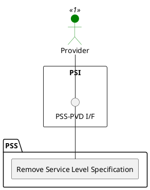

=begin

# TOD-06-02-03-Remove_Service_Level_Specification

> The heading has to be included in the document including this document.

=end

{#fig:TOD-06-02-03-Remove_Service_Level_Specification}

**Prerequisites**

The service level specification exists in the PSS datastore.

**Main operation**

Removes a service level specification instance via a standard interface.

**REST Endpoints**

@include [TOD-06-02-03 Remove Service Level Specification](endpoints/TOD-06-02-03-Remove_Service_Level_Specification-endpoints.md)

**Post Conditions**

The service level specification is successfully deleted or indicated it is no longer valid in the PSS datastore.

**Applicable Requirements**

@include [TOD-06-02-03 Remove Service Level Specification](requirements/TOD-06-02-03-Remove_Service_Level_Specification-requirements.md)

**eTOM Reference**

The operation is based on the 1.4.7 process identifier from the eTOM.
