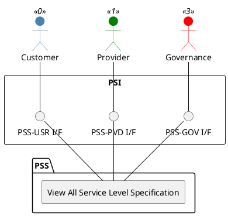

=begin

# TOD-06-02-05-View_All_Service_Level_Specification

> The heading has to be included in the document including this document.

=end

{#fig:TOD-06-02-05-View_All_Service_Level_Specification}

**Prerequisites**

The service level specification exists in the PSS datastore.

**Main operation**

Gets all service level specification instance via a standard interface.
Customers can only view the service level specifications granted by providers.

**REST Endpoints**

@include [TOD-06-02-05 View All Service Level Specifications](endpoints/TOD-06-02-05-View_All_Service_Level_Specification-endpoints.md)

**Post Conditions**

All visible service level specifications are successfully returned for viewing.

**Applicable Requirements**

@include [TOD-06-02-05 View_All Service Level Specifications](requirements/TOD-06-02-05-View_All_Service_Level_Specification-requirements.md)

**eTOM Reference**

The operation is based on the 1.4.7 process identifier from the eTOM.
