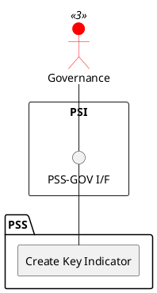

=begin

# TOD-06-03-01-Create_Key_Indicator

> The heading has to be included in the document including this document.

=end

{#fig:TOD-06-03-01-Create_Key_Indicator}

**Prerequisites**

The key indicator does not exist in the PSS datastore.

**Main operation**

Creates a new key indicator instance via a standard interface.

Some properties of a key indicator are:

* *name* - Short name of the key indicator
* *indicatorType* - KPI or KQI
* *isBundled* - A boolean that specifies whether the key indicator represents a single key indicator (false) or a key indicator that represents an aggregation (true)
* *validFor* - The validity of the key indicator
* *keyIndicatorRelationship* - A list of key indicator relationships related to this object

**REST Endpoints**

@include [TOD-06-03-01 Create Key Indicator](endpoints/TOD-06-03-01-Create_Key_Indicator-endpoints.md)

**Post Conditions**

The key indicator is successfully created in the PSS datastore.

**Applicable Requirements**

@include [TOD-06-03-01 Create Key Indicator](requirements/TOD-06-03-01-Create_Key_Indicator-requirements.md)

**eTOM Reference**

The operation is based on the 1.4.7 process identifier from the eTOM.
