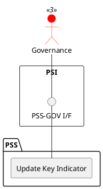

=begin

# TOD-06-03-02-Update_Key_Indicator

> The heading has to be included in the document including this document.

=end

{#fig:TOD-06-03-02-Update_Key_Indicator}

**Prerequisites**

The key indicator exists in the PSS datastore.

**Main operation**

Updates a key indicator instance via a standard interface.

**REST Endpoints**

@include [TOD-06-03-02 Update Key Indicator](endpoints/TOD-06-03-02-Update_Key_Indicator-endpoints.md)

**Post Conditions**

The key indicator is successfully updated in the PSS datastore.

**Applicable Requirements**

@include [TOD-06-03-02 Update Key Indicator](requirements/TOD-06-03-02-Update_Key_Indicator-requirements.md)

**eTOM Reference**

The operation is based on the 1.4.7 process identifier from the eTOM.
