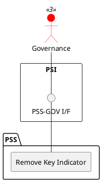

=begin

# TOD-06-03-03-Remove_Key_Indicator

> The heading has to be included in the document including this document.

=end

{#fig:TOD-06-03-03-Remove_Key_Indicator}

**Prerequisites**

The Key Indicator exists in the PSS datastore and is not used by available Service Level Objective.

**Main operation**

Removes a Key Indicator instance via a standard interface.

**REST Endpoints**

@include [TOD-06-03-03 Remove Key Indicator](endpoints/TOD-06-03-03-Remove_Key_Indicator-endpoints.md)

**Post Conditions**

The Key Indicator is successfully deleted or indicated it is no longer valid in the PSS datastore.

**Applicable Requirements**

@include [TOD-06-03-03 Remove Key Indicator](requirements/TOD-06-03-03-Remove_Key_Indicator-requirements.md)

**eTOM Reference**

The operation is based on the 1.4.7 process identifier from the eTOM.
