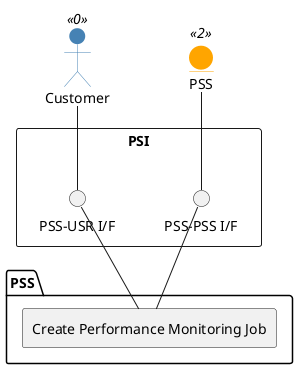

=begin

# TOD-06-04-01-Create_Performance_Monitoring_Job

> The heading has to be included in the document including this document.

=end

{#fig:TOD-06-04-01-Create_Performance_Monitoring_Job}

**Prerequisites**

Service for which PM job needs to be executed exists in the PSS datastore.
Applicable key indicators are defined in the PSS datastore.

**Main operation**

Creates a new Performance Monitoring Job instance via a standard interface.

Some properties of a Performance Monitoring Job are:

* *granularity* - Sampling rate of the collection or production of performance indicators, e.g. 10 milliseconds, 1 second, 5 minutes, 24 hours
* *jobType* - Always on-demand
* *outputFormat* - Output formats for the Performance Report: json, xml, avro, csv
* *reportingPeriod* - Defines the interval for the report generation
* *resultFormat* - Defines how the provider will deliver the Performance Report generated by the job to the PSS:
  * payload data will be delivered directly in the "Get Report" API response
  * attachment data will be stored in the file and the API response will contain a URL to the file
* *scheduleDefinition* - The schedule definition for running jobs
* *servicePayloadSpecificAttributes* - an extension point for service-specific performance monitoring configuration. It includes a definition of observed service and applicable performance monitoring objectives.

**REST Endpoints**

@include [TOD-06-04-01 Create Performance Monitoring Job](endpoints/TOD-06-04-01-Create_Performance_Monitoring_Job-endpoints.md)

**Post Conditions**

The PM job is successfully created in the PSS datastore.

**Applicable Requirements**

@include [TOD-06-04-01 Create Performance Monitoring Job](requirements/TOD-06-04-01-Create_Performance_Monitoring_Job-requirements.md)

**eTOM Reference**

The operation is based on the 1.4.7 process identifier from the eTOM.
