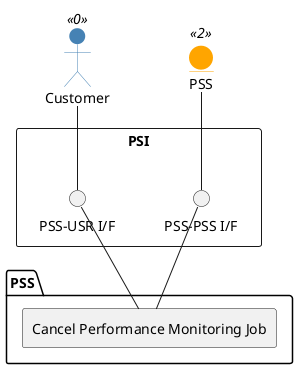

=begin

# TOD-06-04-03-Cancel_Performance_Monitoring_Job

> The heading has to be included in the document including this document.

=end

{#fig:TOD-06-04-03-Cancel_Performance_Monitoring_Job}

**Prerequisites**

The Performance Monitoring Job exists in the PSS datastore.

**Main operation**

Cancels a Performance Monitoring Job instance via a standard interface.

**REST Endpoints**

@include [TOD-06-04-03 Cancel Performance Monitoring Job](endpoints/TOD-06-04-03-Cancel_Performance_Monitoring_Job-endpoints.md)

**Post Conditions**

The Performance Monitoring Job is successfully canceled or indicated it is no longer valid in the PSS datastore.

**Applicable Requirements**

@include [TOD-06-04-03 Cancel Performance Monitoring Job](requirements/TOD-06-04-03-Cancel_Performance_Monitoring_Job-requirements.md)

**eTOM Reference**

The operation is based on the 1.4.7 process identifier from the eTOM.
