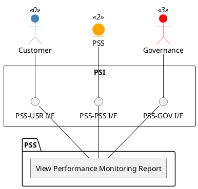

=begin

# TOD-06-05-02-View_Performance_Monitoring_Report

> The heading has to be included in the document including this document.

=end

{#fig:TOD-06-05-02-View_Performance_Monitoring_Report}

**Prerequisites**

The Performance Monitoring Report exists in the PSS datastore.

**Main operation**

Gets a Performance Monitoring Report instance via a standard interface.

**REST Endpoints**

@include [TOD-06-05-02 View Performance Monitoring Report](endpoints/TOD-06-05-02-View_Performance_Monitoring_Report-endpoints.md)

**Post Conditions**

The Performance Monitoring Report is successfully returned for viewing.

**Applicable Requirements**

@include [TOD-06-05-02 View Performance Monitoring Report](requirements/TOD-06-05-02-View_Performance_Monitoring_Report-requirements.md)

**eTOM Reference**

The operation is based on the 1.4.7 process identifier from the eTOM.
