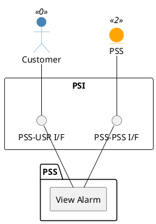

=begin

# TOD-06-06-01-View_Alarm

> The heading has to be included in the document including this document.

=end

{#fig:TOD-06-06-01-View_Alarm}

**Prerequisites**

The Alarm exists in the PSS datastore.

**Main operation**

Gets an Alarm instance via a standard interface.

**REST Endpoints**

@include [TOD-06-06-01 View Alarm](endpoints/TOD-06-06-01-View_Alarm-endpoints.md)

**Post Conditions**

The Alarm is successfully returned for viewing.

**Applicable Requirements**

@include [TOD-06-06-01 View Alarm](requirements/TOD-06-06-01-View_Alarm-requirements.md)

**eTOM Reference**

The operation is based on the 1.4.6 and 1.5.8 process identifier from the eTOM.
