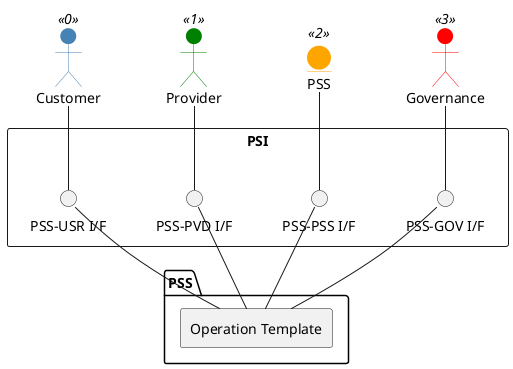

=begin

# TOD-XX-XX-XX-Operation_Template

> The heading has to be included in the document including this document.

=end

Just like for the tasks, the section title gives a general overview of the operation.
It states its ID for reference with six digits (*TOD-XX-XX-XX*) and its name (*Operation_Template*).

Below, the operation is shown graphically.
Here, the PSS takes the role of the server and implements the operation as REST endpoint(s), while the actors above are the clients that invoke the endpoint(s) to perform the operation.
The interfaces involved are depicted in the PSI layer of the diagram.
For example, the customer uses the operation implemented by the PSS via the PSS-USR interface.

=begin

> Delete the description above.
> If needed, uses this space for a general explanatory sentence or short text.
> Update the table above and the plantuml graphic below.

=end

{#fig:TOD-XX-XX-XX-Operation_Template}

**Prerequisites**

Some operations might have prerequisites to be performed.
For example, a party that already is registered to the PSS should not be allowed to register their profile again.

=begin

> Delete and replace with the actual prerequisites.

=end

**Main operation**

Creates a profile for a party with basic party data, identification data, contact data and additional attributes, via a standard interface specification.

The party can be an individual or an organization.

**REST Endpoints**

The REST endpoints implementing the operation are listed here.
Commonly, an operation has one or more associated endpoints with a common HTTP method like `POST`, `PATCH`, `DELETE`, or `GET`.
They may look like listed below and can be referenced in the [PSI-ICD].

* POST /psi-api/foo/v2/bar
* PATCH /psi-api/foo/v2/bar/{id}
* PATCH /psi-api/foo/v2/baz/{id}
* DELETE /psi-api/foo/v2/bar/{id}
* GET /psi-api/foo/v2/bar/{id}

=begin

> Delete the text above and include the corresponding auto-generated file following this file's naming:
>
> include [TOD-XX-XX-XX Operation Template Endpoints](endpoints/TOD-XX-XX-XX-Operation_Template-endpoints.md)

=end

**Post Conditions**

Most operations have a post condition, i.e., there is a system change that can be checked.
For example, if the operation [TOD-01-01-01-Create_Party_Profile](#tod-01-01-01-createpartyprofile) is performed successfully, the profile for the party is successfully created in the PSS datastore.

**Applicable Requirements**

Each operation is defined by one or more requirement listed below.
For details, see [PSI-REQ], which follows the same structure as this document for easy reference.

* PSI-XX-XX-XX-01
* PSI-XX-XX-XX-02
* ...
* PSI-XX-XX-XX-NN

=begin

> Delete the text above and include the corresponding auto-generated file following this file's naming:
>
> include [TOD-XX-XX-XX Operation Template Requirements](requirements/TOD-XX-XX-XX-Operation_Template-requirements.md)

=end

**eTOM Reference**

Most tasks can be mapped to TM Forum's eTOM in one way or another.
Identified processes of eTOM v22.0.0 are linked by the eTOM *Process Identifier*.
For more details about the eTOM processes, please check the eTOM Process Decomposition L3[^eTOM-Decomposition-L3] and L4[^eTOM-Decomposition-L4].

=begin

> Delete the description above and replace with the text below adapted for this operation.

The operation is based on X.X.X.X process identifiers from the eTOM v22.0.0.

=end

[^eTOM-Decomposition-L3]: See <https://www.tmforum.org/resources/reference/gb921d-l3-process-decompositions-v22-0-0>  
[^eTOM-Decomposition-L4]: See <https://www.tmforum.org/resources/reference/gb921dx-l4-process-decompositions-v22-0-0>