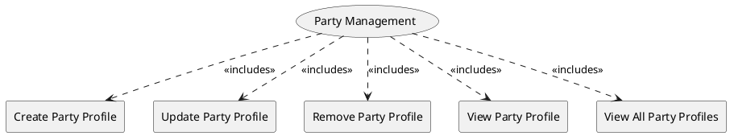

=begin

# TOD-01-01-Party_Management

> The heading has to be included in the document including this document.

=end

The Party Management task takes care of the lifecycles of parties with whom the PSS has a relationship.
A party can be a natural person (individual) or an organization.

A customer wants to utilize a PSS to find/inquire and then order resources, services or products offered by providers.
A provider wants to pool its resources, services, products and offerings to a PSS, so that they can be found and ordered by customers.
Another PSS needs to be able to view the resources, service, products and offerings as well.

Therefore, a new customer/provider or another PSS, needs to register themselves as a party to a PSS via a standard interface to start the business interaction.
Additionally, they need to view the information stored in the PSS, update the party profile, or delete it from the PSS.
The governance of the PSS needs also to be able to manage the different party profiles (e.g. create/update/remove/view a party profile or view all party profiles).  

{#fig:TOD-01-01-Party_Management}

|                             |  Customer  |  Provider  | Other PSS  | Governance |
|-----------------------------|:----------:|:----------:|:----------:|:----------:|
| **Create Party Profile**    | \checkmark | \checkmark |            | \checkmark |
| **Update Party Profile**    | \checkmark | \checkmark |            | \checkmark |
| **Remove Party Profile**    | \checkmark | \checkmark |            | \checkmark |
| **View Party Profile**      | \checkmark | \checkmark | \checkmark | \checkmark |
| **View All Party Profiles** | \checkmark | \checkmark | \checkmark | \checkmark |

Table: Party Management Matrix. {#tbl:party-management-matrix}

**eTOM Reference**

The task is based on the 1.3.6 and 1.6.21 process identifiers from the eTOM.

