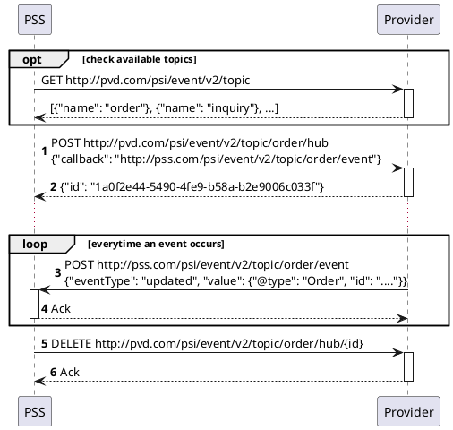
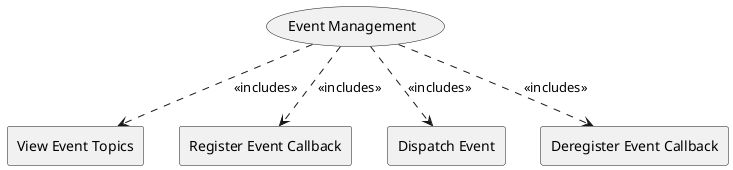

=begin

# TOD-01-02-Event_Management

> The heading has to be included in the document including this document.

=end

Some processes between a PSS and a provider (or PSS and PSS), such as customer inquiries and orders, can take longer time to complete.
For example, when a customer inquiry is created, the provider may require significant time to process and respond with an adequate product offering.
Or, when a product order is placed by a customer, it can take hours to days for its state to change, e.g. from 'inProgress' to 'completed'.

Inside a PSS (or a sophisticated provider system) the anticipated approach to propagate such state changes are message queues.
A direct connection between these, although possible, would result in a strong coupling of the systems and major implications by the interface definition on the internal implementations.
In order to avoid this, the Event Management defines how to exchange the information using REST.

> Note that this does not **enforce** the use of message queues.
All named operations and endpoints can also be implemented in a monolithic application.

The Event Management task is based on the exchange of events between two systems.
*Topics* are target containers for events which exist to store different events separated into domains.
A PSS must have at least three topics: *order*, *inquiry* and *alarm*.
Hence, all events related to orders are collected in the *order* topic, while the events of the inquiries are stored in the *inquiry* topic.
Alarms related to breaching service level specification are stored in the *alarm* topic.
However, PSS and provider systems are allowed to define additional topics, if needed, to organise the events in their interface implementation.

The following diagram illustrates a usual execution sequence, using the "order" topic as an example:

{#fig:TOD-01-02-Event_Management-sequence}

The shown steps are further described in the following operations:

{#fig:TOD-01-02-Event_Management}

|                               | Customer |  Provider  | Other PSS  | Governance |
|-------------------------------|:--------:|:----------:|:----------:|:----------:|
| **View Event Topics**         |          | \checkmark | \checkmark |            |
| **Register Event Callback**   |          | \checkmark | \checkmark |            |
| **Dispatch Event**            |          | \checkmark | \checkmark |            |
| **Deregister Event Callback** |          | \checkmark | \checkmark |            |

Table: Event Management Matrix. {#tbl:event-management-matrix}

Please note that the Governance does not get direct access to the endpoints.
Nevertheless, the Governance usually has read access to the event data via the monitoring service.

**eTOM Reference**

None
