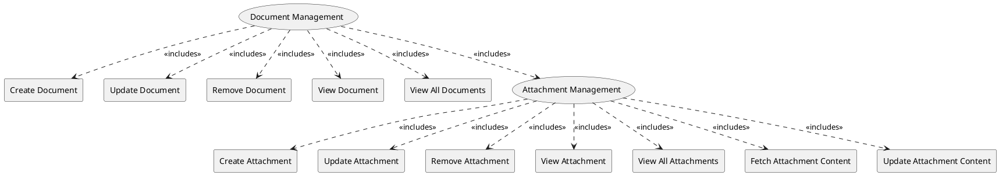

=begin

# TOD-01-03-Document_Management

> The heading has to be included in the document including this document.

=end

The Document Management task is responsible for managing documents that need to be exchanged between providers, customers and PSS.
For example, a product offering of a provider is accompanied by a Service Level Agreement that should be shared with the customer via REST API, or when an order is concluded, an interface is required for sending the invoice.

Any party involved in the PSI processes needs to be able to create, update, remove or view available document(s).
Each document can have arbitrary characteristics describing the document itself or the context of it, for example order numbers.
It can also be directly linked to other documents or entities of other APIs.

The content of the document is stored in one or more attachments, which can be uploaded either binary or encoded in [Base64](https://en.wikipedia.org/wiki/Base64) format along with the mime type e.g. "application/pdf", "application/msword" or "image/jpeg".
The party implementing the interface endpoints should take care of performing a malware scan of the created attachments.
While the PSID does not define how the content is stored, it enables use of cloud storage like S3 as well as plain filesystem access.
In both scenarios, read/write access is handled by the same HTTP endpoint.

> Note that while the Document Management is derived from [TM Forum Document Management API v4.0.0](https://tmf-open-api-table-documents.s3.eu-west-1.amazonaws.com/OpenApiTable/4.0.0/user_guides/TMF667_Document_Management_API_REST_Specification_v4-0-0.pdf), it introduces a lot of (partially incompatible) changes, because the operations of this task are envisioned but not yet defined in TM Forum.
> Therefore, this task might be subject to change when a new version of TM Forum's Document Management API will be released.

{#fig:TOD-01-03-Document_Management}

|                               |  Customer  |  Provider  | Other PSS  | Governance |
|-------------------------------|:----------:|:----------:|:----------:|:----------:|
| **Create Document**           | \checkmark | \checkmark |            |            |
| **Update Document**           | \checkmark | \checkmark |            |            |
| **Remove Document**           | \checkmark | \checkmark |            |            |
| **View Document**             | \checkmark | \checkmark | \checkmark | \checkmark |
| **View All Documents**        | \checkmark | \checkmark | \checkmark | \checkmark |
| **Create Attachment**         | \checkmark | \checkmark |            |            |
| **Update Attachment**         | \checkmark | \checkmark |            |            |
| **Remove Attachment**         | \checkmark | \checkmark |            |            |
| **View Attachment**           | \checkmark | \checkmark | \checkmark | \checkmark |
| **View All Attachments**      | \checkmark | \checkmark | \checkmark | \checkmark |
| **Fetch Attachment Content**  | \checkmark | \checkmark | \checkmark | \checkmark |
| **Update Attachment Content** | \checkmark | \checkmark |            |            |

Table: Document Management Matrix. {#tbl:document-management-matrix}

**eTOM Reference**

None
