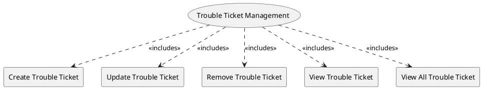

=begin

# TOD-01-04-Trouble_Ticket_Management

> The heading has to be included in the document including this document.

=end

The Trouble Ticket Management task is responsible for tracking incident reports, complaints and other requests of customers and providers.
They can be processed either by a PSS helpdesk operator if they concern the functionality of the PSS itself, or by the provider if they affect a (Gov)SatCom service.
Most likely, the actual implementation is outsourced to an existing ticket system or the CRM.

{#fig:TOD-01-04-Trouble_Ticket_Management}

|                               |  Customer  |  Provider  | Other PSS  | Governance |
|-------------------------------|:----------:|:----------:|:----------:|:----------:|
| **Create Trouble Ticket**     | \checkmark | \checkmark |            |            |
| **Update Trouble Ticket**     | \checkmark | \checkmark |            | \checkmark |
| **Remove Trouble Ticket**     | \checkmark | \checkmark |            |            |
| **View Trouble Ticket**       | \checkmark | \checkmark |            | \checkmark |
| **View All Trouble Ticket**   | \checkmark | \checkmark |            | \checkmark |

Table: Trouble Ticket Management Matrix. {#tbl:trouble-ticket-management-matrix}

**eTOM Reference**

The task is based on the 1.4.6 process identifier from the eTOM.
