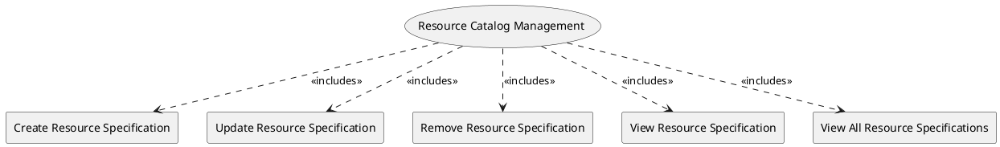

=begin

# TOD-02-01-Resource_Catalog_Management

> The heading has to be included in the document including this document.

=end

The Resource Catalog Management task takes care of the maintenance of resource specifications available in the PSS, brought in by providers.

A provider wants to utilize a PSS to offer their resources to the users of the PSS.
The resources implement a resource specification (describing general characteristics of the resource), and they can be **physical** (e.g. antennas, BUCs and other hardware, satellites, etc.), **logical** (e.g. IP addresses, software) or **compound** (e.g. router consists of different cards/ports and runs software).
These are inputs to the PSS which are further constructed/marketed/brokered as products.

Therefore, a provider needs to be able to register(create) resource specifications to the PSS, modify, remove or view them.
Another PSS needs to be able to view the resources specifications as well.

Additionally, a customer needs to be able to declare its own resources (e.g. terminal/teleport) into the PSS and later use them as part of a customer inquiry.
Details of the matchmaking, such as resource sharing with other customers, are up to the respective PSS implementation.

{#fig:TOD-02-01-Resource_Catalog_Management}

|                                      |  Customer  |  Provider  | Other PSS  | Governance |
|--------------------------------------|:----------:|:----------:|:----------:|:----------:|
| **Create Resource Specification**    | \checkmark | \checkmark |            |            |
| **Update Resource Specification**    | \checkmark | \checkmark |            |            |
| **Remove Resource Specification**    | \checkmark | \checkmark |            |            |
| **View Resource Specification**      | \checkmark | \checkmark | \checkmark | \checkmark |
| **View All Resource Specifications** | \checkmark | \checkmark | \checkmark | \checkmark |

Table: Resource Catalog Management Matrix. {#tbl:resource-catalog-management-matrix}

**eTOM Reference**

The task is based on the 1.5.17 and 1.5.3 process identifiers from the eTOM.
