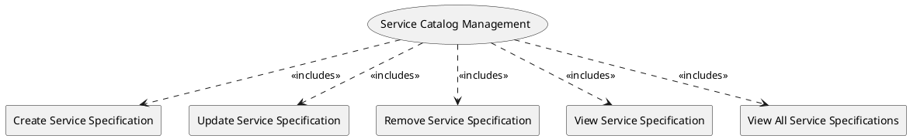

=begin

# TOD-02-02-Service_Catalog_Management

> The heading has to be included in the document including this document.

=end

The Service Catalog Management task takes care of the maintenance of service specifications available in the PSS, brought in by providers.

A provider wants to utilize a PSS to offer their services to the users of the PSS.
The services implement a service specification (describing general characteristics of the service), and they represent a communication service such as internet access, telephony, site-to-site IP-Trunk, etc. which require utilization of different resources.
These are inputs to the PSS which are further constructed/marketed/brokered as products.

Therefore, a provider needs to be able to register(create) service specifications to the PSS, modify, remove or view them.
Another PSS needs to be able to view the disclosed service specifications as well.

{#fig:TOD-02-02-Service_Catalog_Management}

|                                     |  Customer  |  Provider  | Other PSS  | Governance |
|-------------------------------------|:----------:|:----------:|:----------:|:----------:|
| **Create Service Specification**    |            | \checkmark |            |            |
| **Update Service Specification**    |            | \checkmark |            |            |
| **Remove Service Specification**    |            | \checkmark |            |            |
| **View Service Specification**      | \checkmark | \checkmark | \checkmark |            |
| **View All Service Specifications** | \checkmark | \checkmark | \checkmark |            |

Table: Service Catalog Management Matrix. {#tbl:service-catalog-management-matrix}

**eTOM Reference**

The task is based on the 1.4.15 and 1.4.3 process identifiers from the eTOM.

