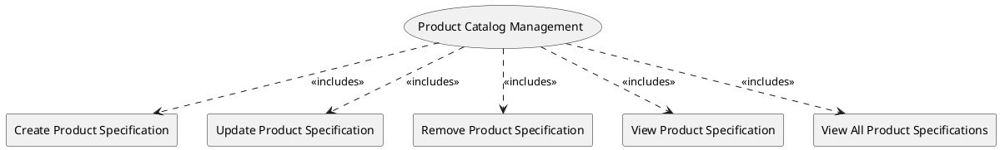

=begin

# TOD-02-03-Product_Catalog_Management

> The heading has to be included in the document including this document.

=end

The Product Catalog Management task takes care of the maintenance of product specifications available in the PSS, brought in by providers.

A provider wants to utilize a PSS to offer their products to the users of the PSS.
The products implement a product specification (describing general characteristics of the product), and they bundle one or more services and/or on-site resources.

Therefore, a provider needs to be able to register(create) product specifications to the PSS, modify, remove or view them.
Another PSS needs to be able to view the product specifications as well.

{#fig:TOD-02-03-Product_Catalog_Management}

|                                     |  Customer  |  Provider  | Other PSS  | Governance |
|-------------------------------------|:----------:|:----------:|:----------:|:----------:|
| **Create Product Specification**    |            | \checkmark |            |            |
| **Update Product Specification**    |            | \checkmark |            |            |
| **Remove Product Specification**    |            | \checkmark |            |            |
| **View Product Specification**      | \checkmark | \checkmark | \checkmark | \checkmark |
| **View All Product Specifications** | \checkmark | \checkmark | \checkmark | \checkmark |

Table: Product Catalog Management Matrix. {#tbl:product-catalog-management-matrix}

**eTOM Reference**

The task is based on the 1.2.22 and 1.2.7 process identifiers from the eTOM.
