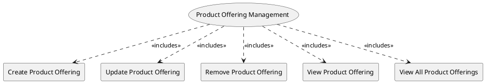

=begin

# TOD-02-04-Product_Offering_Management

> The heading has to be included in the document including this document.

=end

The Product Offering Management task takes care of the maintenance of product offerings available in the PSS, brought in by providers.

A provider wants to utilize a PSS to make a concrete offer with a price and SLS of a product specification to the users of the PSS.

Therefore, a provider needs to be able to register(create) product offerings to the PSS, modify, remove or view them.
Another PSS needs to be able to view the product offerings as well.

{#fig:TOD-02-04-Product_Offering_Management}

|                                |  Customer  |  Provider  | Other PSS  | Governance |
|--------------------------------|:----------:|:----------:|:----------:|:----------:|
| **Create Product Offering**    |            | \checkmark |            |            |
| **Update Product Offering**    |            | \checkmark |            |            |
| **Remove Product Offering**    |            | \checkmark |            |            |
| **View Product Offering**      | \checkmark | \checkmark | \checkmark |            |
| **View All Product Offerings** | \checkmark | \checkmark | \checkmark |            |

Table: Product Offering Management Matrix. {#tbl:product-offering-management-matrix}

**eTOM Reference**

The task is based on the 1.2.7.2 process identifier from the eTOM.

