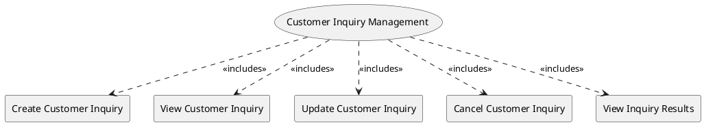

=begin

# TOD-03-01-Customer_Inquiry_Management

> The heading has to be included in the document including this document.

=end

The Customer Inquiry Management task takes care of the handling of inquiries sent by a customer and responded by a PSS or provider.

The PSS may provide different ways for the customer to create an inquiry, depending on the expertise of the user.
These can range from just selecting from templates with commonly used product types, optionally customizing the characteristics or even the manual definition of the communication needs.

An inquiry is stateful and can be processed in different ways:
Firstly, the PSS can implement a matchmaking algorithm that searches the local database to provide immediate results.
This process can also be partially or fully outsourced to other PSSs and sufficiently advanced provider systems that are able to respond in real-time.
The PSS will then aggregate, rank and possibly filter the results before making them available to the customer.
In the case of a Request-For-Quote or Invitation-To-Tender, human intervention is foreseen to tailor a product offering, which can take some hours or days.

To prevent long delays for the customer, the response time of the providers to an RFQ or ITT should be limited.
The governance of the PSS can set the maximum inquiry response time for each provider in their party profiles according to their SLA.
The provider is then responsible to respect the response time and provide the inquiry results within the expected time frame.
The PSS is responsible to implement mechanisms to monitor the response times of the provider for each customer inquiry and ensure the provider respects the response time provided by the governance of the PSS.
In case the provider exceeds the given deadline, its product offering(s) will not be considered for the issued inquiry.

The customer inquiry result may contain

* Concrete product offerings which can be ordered directly (see [TOD-03-02](#tod-03-02-product_order_management))
* Product instances from the inventory that are available to fulfil the order
* Matching product specifications to request a tailored offering for (RFQ or ITT)

If the customer is not satisfied with the result, they may refine their criteria and send a new inquiry.
To speed up the access and the review of responses to delegated inquiries, a PSS can download and cache offerings as they become available.

{#fig:TOD-03-01-Customer_Inquiry_Management}

|                             |  Customer  |  Provider  |  Other PSS   | Governance |
|-----------------------------|:----------:|:----------:|:------------:|:----------:|
| **Create Customer Inquiry** | \checkmark |            | (\checkmark) |            |
| **View Customer Inquiry**   | \checkmark | \checkmark |  \checkmark  |            |
| **Update Customer Inquiry** | \checkmark |            | (\checkmark) |            |
| **Cancel Customer Inquiry** | \checkmark |            | (\checkmark) |            |
| **View Inquiry Results**    | \checkmark |            |  \checkmark  |            |

Table: Customer Inquiry Management Matrix. {#tbl:customer-inquiry-management-matrix}

Please note, Checkmarks in parentheses indicate that these operations
are carried out via events (see [TOD-01-02](#tod-01-02-event_management)), not via direct call of the REST endpoints.

**eTOM Reference**

The task is based on the 1.3.5 process identifier from the eTOM.
