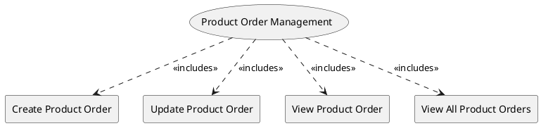

=begin

# TOD-03-02-Product_Order_Management

> The heading has to be included in the document including this document.

=end

The Product Order Management task takes care of the handling of orders sent by a customer to a PSS.

The customer wants to utilise a PSS to place an order.
The PSS receives the order and is responsible to forward it to the respective provider that can realise the order items selected by the customer.
The provider usually requires some time to process the order and update its state to `acknowledged` or `completed` for instance.
Therefore, the PSS and the provider establish asynchronous communication via the Event Management API (see [TOD-01-02](TOD-01-02-Event_Management.md)) towards exchanging order updates.
The PSS is then responsible to inform the customer about the up-to-date state of the order.

To prevent long delays for the customer, the governance of the PSS can set an order response time for each provider in their party profiles.
The provider is then responsible to respect the response time and `acknowledge` the order within the expected time frame.
The PSS is responsible to implement mechanisms to monitor the response times of the provider for each order and ensure the provider respects the response time provided by the governance of the PSS.

Additionally, the customer and provider need to be able to modify properties (e.g. the billing information) of an existing order in the PSS if the current state of the order allows that.
For example, if an order is `completed`, any updates should be rejected by the PSS.
If they want to change product characteristics (e.g. increase the bandwidth), a new order has to be created and will replace the existing one.
They also need to be able to view an existing order or all the orders that are applicable to them in the PSS.

{#fig:TOD-03-02-Product_Order_Management}

|                             |  Customer  |  Provider  |  Other PSS   | Governance |
|-----------------------------|:----------:|:----------:|:------------:|:----------:|
| **Create Product Order**    | \checkmark |            | (\checkmark) |            |
| **Update Product Order**    | \checkmark | \checkmark | (\checkmark) |            |
| **View Product Order**      | \checkmark | \checkmark |              |            |
| **View All Product Orders** | \checkmark | \checkmark |              |            |

Table: Product Order Management Matrix. {#tbl:product-order-management-matrix}

**eTOM Reference**

The task is based on the 1.3.2 process identifier from the eTOM.

