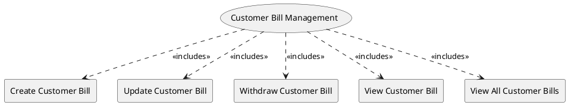

=begin

# TOD-03-03-Customer_Bill_Management

> The heading has to be included in the document including this document.

=end

The Customer Bill Management task takes care of bills (invoices) produced for a customer for placed orders in the PSS.
A customer bill or invoice is a document produced at the end of a regular back office process at the provider side which runs according to a bill cycle definition.
The customer bill contains information about the total amount due to be paid by a customer for the ordered product(s) during the billing period, the due date for the payment, and other information like the order and attachment references.

A *provider* wants to utilise the PSS to publish the bill and make it available to the customer.
Additionally, a provider might need to change the state of the bill in the PSS, for example when a customer has paid it.

The *customer* wants to utilise the PSS to find and retrieve one or several customer bills produced for them.
Also, the provider can use the PSS to find and retrieve the bills that have been created by them to the PSS.

{#fig:TOD-03-03-Customer_Bill_Management}

|                             |  Customer  |  Provider  |  Other PSS   | Governance |
|-----------------------------|:----------:|:----------:|:------------:|:----------:|
| **Create Customer Bill**    |            | \checkmark | (\checkmark) |            |
| **Update Customer Bill**    |            | \checkmark | (\checkmark) |            |
| **Withdraw Customer Bill**  |            | \checkmark | (\checkmark) |            |
| **View Customer Bill**      | \checkmark | \checkmark |              |            |
| **View All Customer Bills** | \checkmark | \checkmark |              |            |

Table: Customer Bill Management Matrix. {#tbl:customer-bill-management-matrix}

**eTOM Reference**

The task is based on the 1.3.9 process identifier from the eTOM.

