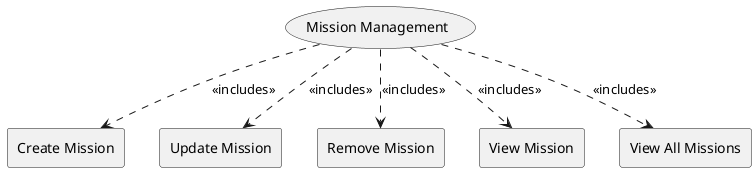

=begin

# TOD-03-04-Mission_Management

> The heading has to be included in the document including this document.

=end

The Mission Management task enables the customer to plan and monitor mission related communication products.
While this is an PSS-internal workflow, exposing it via PSI allows advanced and profession-specific software to make use of it as well.

The mission is defined by the customer using a name and a timeframe.
They then define geographies (i.e., areas or points) where it will take place and optionally teams that operate there.
Note that this can be done in any order and also be updated over time as the mission evolves.
Based on these, the customer defines communication needs like internet access, site-2-site IP trunks or telephony.
When they found a matching product (e.g. by issuing an [Inquiry](#tod-03-04-customer_inquiry_management)), a reference to it can be stored as well to enable access to further operations such as monitoring or change requests.

{#fig:TOD-03-04-Mission_Management}

|                             |  Customer  |  Provider  |  Other PSS   | Governance |
|-----------------------------|:----------:|:----------:|:------------:|:----------:|
| **Create Mission**          | \checkmark |            |              |            |
| **Update Mission**          | \checkmark |            |              |            |
| **Remove Mission**          | \checkmark |            |              |            |
| **View Mission**            | \checkmark |            |              |            |
| **View All Missions**       | \checkmark |            |              |            |

Table: Mission Management Matrix. {#tbl:customer-inquiry-management-matrix}

**eTOM Reference**

The task is not based on the eTOM.
