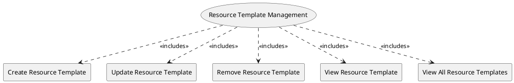

=begin

# TOD-04-01-Resource_Template_Management

> The heading has to be included in the document including this document.

=end

The Resource Template Management task takes care of handling templates (descriptors) with static and dynamic fields containing all the necessary information that would help a provider register a resource specification to a PSS.

The governance of the PSS is responsible to create and maintain the resource templates and group them by resource type.
For example, there can be resource templates for modems, antennas, satellite constellations, etc.
The templates must be provider-agnostic, meaning all the providers should be able to use them to pool resource specifications.

The provider is able to request all the available resource templates and filter them by resource type or template name.
Once they have the target template, they can update the default values proposed by the PSS's governance and define custom values.
Tailored this way, the provider can register a resource specification to the PSS, while saving significant time in defining it from scratch.

The customer is also able to request available resource templates in order to be able to easily declare their own resources to the PSS and then use them as part of a customer inquiry.

{#fig:TOD-04-01-Resource_Template_Management}

|                                 |  Customer  |  Provider  | Other PSS | Governance |
|---------------------------------|:----------:|:----------:|:---------:|:----------:|
| **Create Resource Template**    |            |            |           | \checkmark |
| **Update Resource Template**    |            |            |           | \checkmark |
| **Remove Resource Template**    |            |            |           | \checkmark |
| **View Resource Template**      | \checkmark | \checkmark |           | \checkmark |
| **View All Resource Templates** | \checkmark | \checkmark |           | \checkmark |

Table: Resource Template Management Matrix. {#tbl:resource-template-management-matrix}

**Applicable Requirements**

@include [TOD-04-01 Resource Template Management Requirements](requirements/TOD-04-01-Resource_Template_Management-requirements.md)

**eTOM Reference**

None
