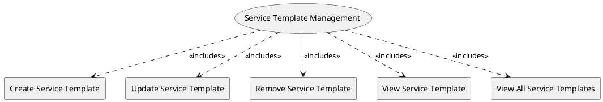

=begin

# TOD-04-02-Service_Template_Management

> The heading has to be included in the document including this document.

=end

The Service Template Management task takes care of handling templates (descriptors) with the static and dynamic fields containing all the necessary information that would help a provider register a service specification to a PSS.

The governance of the PSS is responsible to create and maintain the service templates and group them by service type.
For example, there can be service templates for internet access, telephony, site-to-site IP-Trunk, etc.
The templates must be provider-agnostic, meaning all the providers should be able to use them to pool service specifications.

The provider is able to request all the available service templates and filter them by service type or template name.
Once they have the target template, they can update the default values proposed by the PSS's governance and define custom values.
Tailored this way, the provider can register a service specification to the PSS, while saving significant time in defining it from scratch.

{#fig:TOD-04-02-Service_Template_Management}

|                                | Customer |  Provider  | Other PSS | Governance |
|--------------------------------|:--------:|:----------:|:---------:|:----------:|
| **Create Service Template**    |          |            |           | \checkmark |
| **Update Service Template**    |          |            |           | \checkmark |
| **Remove Service Template**    |          |            |           | \checkmark |
| **View Service Template**      |          | \checkmark |           | \checkmark |
| **View All Service Templates** |          | \checkmark |           | \checkmark |

Table: Service Template Management Matrix. {#tbl:service-template-management-matrix}

**Applicable Requirements**

@include [TOD-04-02 Service Template Management Requirements](requirements/TOD-04-02-Service_Template_Management-requirements.md)

**eTOM Reference**

None
