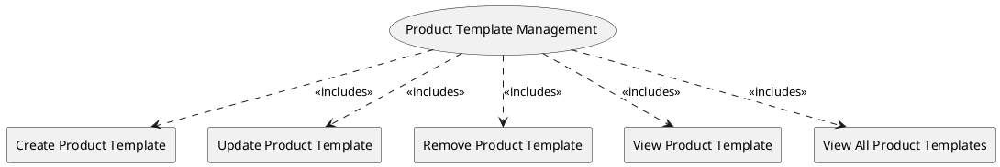

=begin

# TOD-04-03-Product_Template_Management

> The heading has to be included in the document including this document.

=end

The Product Template Management task takes care of handling templates (descriptors) with the static and dynamic fields containing all the necessary information that would help a provider register a product specification to a PSS.

The governance of the PSS is responsible to create and maintain the product templates and group them by product type.
For example, there can be product templates for internet access, telephony, site-to-site IP-Trunk, terminal, etc.
The templates must be provider-agnostic, meaning all the providers should be able to use them to pool product specifications.

The provider is able to request all the available product templates and filter them by product type or template name.
Once they have the target template, they can update the default values proposed by the PSS's governance and define custom values.
Tailored this way, the provider can register a product specification to the PSS, while saving significant time in defining it from scratch.

{#fig:TOD-04-03-Product_Template_Management}

|                                | Customer |  Provider  | Other PSS | Governance |
|--------------------------------|:--------:|:----------:|:---------:|:----------:|
| **Create Product Template**    |          |            |           | \checkmark |
| **Update Product Template**    |          |            |           | \checkmark |
| **Remove Product Template**    |          |            |           | \checkmark |
| **View Product Template**      |          | \checkmark |           | \checkmark |
| **View All Product Templates** |          | \checkmark |           | \checkmark |

Table: Product Template Management Matrix. {#tbl:product-template-management-matrix}

**Applicable Requirements**

@include [TOD-04-03 Product Template Management Requirements](requirements/TOD-04-03-Product_Template_Management-requirements.md)

**eTOM Reference**

None
