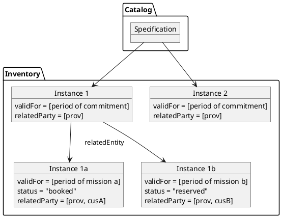
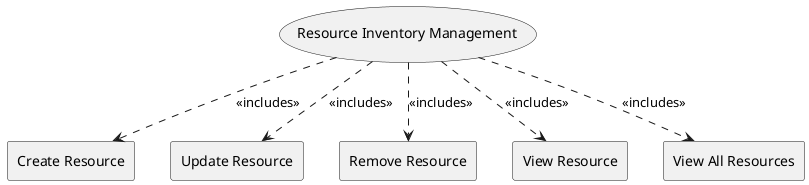

=begin

# TOD-05-01-Resource_Inventory_Management

> The heading has to be included in the document including this document.

=end

The Resource Inventory Management task takes care of the maintenance of resources in the PSS, brought in by providers or customers themselves.

Resources are created based on their specifications and reflect the actual characteristics of an existing instance.
There are two different scenarios to do this:

* For *on-demand* resources, the entity may or may not exist in the provider system.
  They are unknown to the PSS and are only queried via the Stock Management API (cf. [TOD-05-04](#tod-05-04-stockmanagement)).
  Only upon order acceptance (or even afterwards) it is created in the PSS and "lives" for the requested period of time.
* *Committed* resources are created in the PSS beforehand.
  This allows the PSS to internally check the availability in any given timespan.
  Every order (or reservation, if supported) will create a sub-entity that is related to the master-entity and handled like above.

{#fig:resource_tree}

Depending on the implementation, the resource can be further subdivided, e.g. if it is shared with another user or resold by a service provider.
If the resource instance is offered to customers, it has to be wrapped in a product instance resembling their corresponding specifications.

{#fig:TOD-05-01-Resource_Inventory_Management}

|                       |  Customer  |  Provider  | Other PSS | Governance |
|-----------------------|:----------:|:----------:|:---------:|:----------:|
| **Create Resource**   | \checkmark | \checkmark |           |            |
| **Update Resource**   | \checkmark | \checkmark |           |            |
| **Remove Resource**   | \checkmark | \checkmark |           |            |
| **View Resource**     | \checkmark | \checkmark |           | \checkmark |
| **View All Resource** | \checkmark | \checkmark |           | \checkmark |

Table: Resource Inventory Management Matrix. {#tbl:resource-inventory-management-matrix}

**Applicable Requirements**

@include [TOD-05-01 Resource Inventory Management Requirements](requirements/TOD-05-01-Resource_Inventory_Management-requirements.md)

**eTOM Reference**

The task is based on the 1.5.4.5 process identifier from the eTOM.
