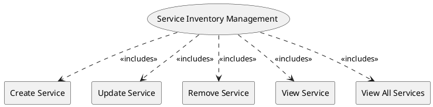

=begin

# TOD-05-02-Service_Inventory_Management

> The heading has to be included in the document including this document.

=end

The Service Inventory Management task takes care of the maintenance of services in the PSS, brought in by providers.

The provider creates services as part of order fulfilment.
Each instance represents a concrete implementation of a service specification for a customer and is bound to a product instance.
They can be also be modified or deleted over time when the customer issues change requests.

The customer can see all their booked services to review their characteristics.

{#fig:TOD-05-02-Service_Inventory_Management}

|                       |  Customer  |  Provider  | Other PSS | Governance |
|-----------------------|:----------:|:----------:|:---------:|:----------:|
| **Create Service**    |            | \checkmark |           |            |
| **Update Service**    |            | \checkmark |           |            |
| **Remove Service**    |            | \checkmark |           |            |
| **View Service**      | \checkmark | \checkmark |           | \checkmark |
| **View All Services** | \checkmark | \checkmark |           | \checkmark |

Table: Service Inventory Management Matrix. {#tbl:service-inventory-management-matrix}

**Applicable Requirements**

@include [TOD-05-02 Service Inventory Management Requirements](requirements/TOD-05-02-Service_Inventory_Management-requirements.md)

**eTOM Reference**

The task is based on the 1.4.4.1 process identifier from the eTOM.
