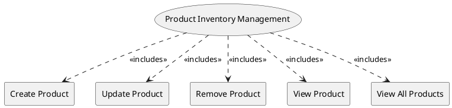

=begin

# TOD-05-03-Product_Inventory_Management

> The heading has to be included in the document including this document.

=end

The Product Inventory Management task takes care of the maintenance of products in the PSS, brought in by providers.

There are two different scenarios to do this:

* A product is created if an order of the corresponding service or resource is fulfilled.
* As stated in [TOD-05-01](#tod-05-01-resource_inventory_management), a product can be stocked and therefore created any time along with its resource.

The PSS manages a priority for each active product instance, which stems from the customer profile or their inquiry.
It is to be stored in a characteristic and can be used for conflict resolution (e.g. pre-emption) when higher priority requests can otherwise not be fulfilled.

They can be also be modified or deleted over time when the customer issues change requests.
The customer can see all their booked products to review their characteristics.

{#fig:TOD-05-03-Product_Inventory_Management}

|                       |  Customer  |  Provider  | Other PSS | Governance |
|-----------------------|:----------:|:----------:|:---------:|:----------:|
| **Create Product**    |            | \checkmark |           |            |
| **Update Product**    |            | \checkmark |           |            |
| **Remove Product**    |            | \checkmark |           |            |
| **View Product**      | \checkmark | \checkmark |           | \checkmark |
| **View All Products** | \checkmark | \checkmark |           | \checkmark |

Table: Product Inventory Management Matrix. {#tbl:product-inventory-management-matrix}

**Applicable Requirements**

@include [TOD-05-03 Product Inventory Management Requirements](requirements/TOD-05-03-Product_Inventory_Management-requirements.md)

**eTOM Reference**

The task is based on the 1.2.11 process identifier from the eTOM.
