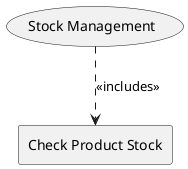

=begin

# TOD-05-04-Stock_Management

> The heading has to be included in the document including this document.

=end

The Stock Management task wraps the inventories to allow a PSS (on behalf of a customer) to check the availability of a provider's product.
There are more operations that are performed internally on the provider side, which are not covered by the PSID but may be implemented consistently with TM Forum.

{#fig:TOD-05-04-Stock_Management}

|                         | Customer | Provider | Other PSS | Governance |    PSS     |
|-------------------------|:--------:|:--------:|:---------:|:----------:|:----------:|
| **Check Product Stock** |          |          |           |            | \checkmark |

Table: Stock Management Matrix. {#tbl:stock-management-matrix}

Please note that in this case the provider's system implements the endpoints and the PSS acts as the client.

**eTOM Reference**

The task is based on the 1.5.4.6 process identifier from the eTOM.
