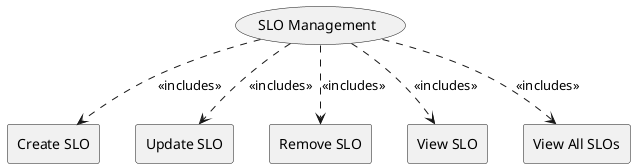

=begin

# TOD-06-01-Service_Level_Objective_Management

> The heading has to be included in the document including this document.

=end

The Service Level Objective Management task takes care of the maintenance of service level objectives (SLOs) in the PSS.
These SLOs direct and control the performance of services to meet the expectations of the customers.

The SLOs can either be specified in advance as part of the service specifications and are therefore part of an offering.
Or the SLOs are defined as part of a negotiation step in ordering process of the PSS.
Regardless of how the SLOs were created, they are referenced in the SLA concluded between the provider and the customer - possibly indirectly via an SLS.

{#fig:TOD-06-01-Service_Level_Objective_Management}

|                   |  Customer  |  Provider  | Other PSS | Governance |
|-------------------|:----------:|:----------:|:---------:|:----------:|
| **Create SLO**    |            | \checkmark |           |            |
| **Update SLO**    |            | \checkmark |           |            |
| **Remove SLO**    |            | \checkmark |           |            |
| **View SLO**      | \checkmark | \checkmark |           | \checkmark |
| **View All SLOs** | \checkmark | \checkmark |           | \checkmark |

Table: Service Level Objective Management Matrix. {#tbl:service-level-objective-management-matrix}

**eTOM Reference**

The task is based on the 1.4.7 process identifier from the eTOM.
