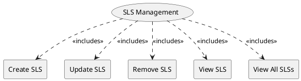

=begin

# TOD-06-02-Service_Level_Specification_Management

> The heading has to be included in the document including this document.

=end

The Service Level Specification Management task takes care of the maintenance of service level specifications (SLSs) in the PSS.
An SLS represents a predefined or negotiated set of service level objectives (SLO - see [TOD-06-01](#tod-06-01-servicelevelobjectivemanagement)).
The requirements for service instances that must be met can then be represented as SLS, which are linked from the corresponding product offerings and/or service specifications.

When an order is issued, a legally binding SLA between the parties might result from an SLS.
As per its nature, it is often documented in PDF or other text formats.
Those documents can be stored in the document management (see [TOD-01-03](#tod-01-03-documentmanagement)).

{#fig:TOD-06-02-Service_Level_Specification_Management}

|                   |  Customer  |  Provider  | Other PSS | Governance |
|-------------------|:----------:|:----------:|:---------:|:----------:|
| **Create SLS**    |            | \checkmark |           |            |
| **Update SLS**    |            | \checkmark |           |            |
| **Remove SLS**    |            | \checkmark |           |            |
| **View SLS**      | \checkmark | \checkmark |           | \checkmark |
| **View All SLSs** | \checkmark | \checkmark |           | \checkmark |

Table: Service Level Specification Management Matrix. {#tbl:service-level-specification-management-matrix}

**eTOM Reference**

The task is based on the 1.4.7 process identifier from the eTOM.
