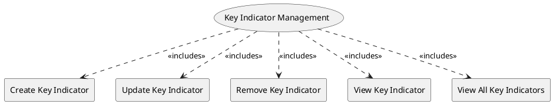

=begin

# TOD-06-03-Key_Indicator_Management

> The heading has to be included in the document including this document.

=end

The Key Indicator Management API task takes care of the maintenance of key indicators in the PSS.
Key Indicators (KPI/KQI) are technical performance or quality parameters of the service.
They are used by the provider to create Service Level Objectives which define threshold values per key indicator (see [TOD-06-01](#tod-06-01-servicelevelobjectivemanagement)).
These thresholds determine the service quality commitment of the service provider.

{#fig:TOD-06-03-Key_Indicator_Management}

|                             |  Customer  |  Provider  | Other PSS  | Governance |
|-----------------------------|:----------:|:----------:|:----------:|:----------:|
| **Create Key Indicator**    |            |            |            | \checkmark |
| **Update Key Indicator**    |            |            |            | \checkmark |
| **Remove Key Indicator**    |            |            |            | \checkmark |
| **View Key Indicator**      |            | \checkmark | \checkmark | \checkmark |
| **View Key Indicators**     |            | \checkmark | \checkmark | \checkmark |

Table: Key Indicator Management Matrix. {#tbl:key-indicator-management-matrix}

**eTOM Reference**

The task is based on the 1.4.7 process identifier from the eTOM.
