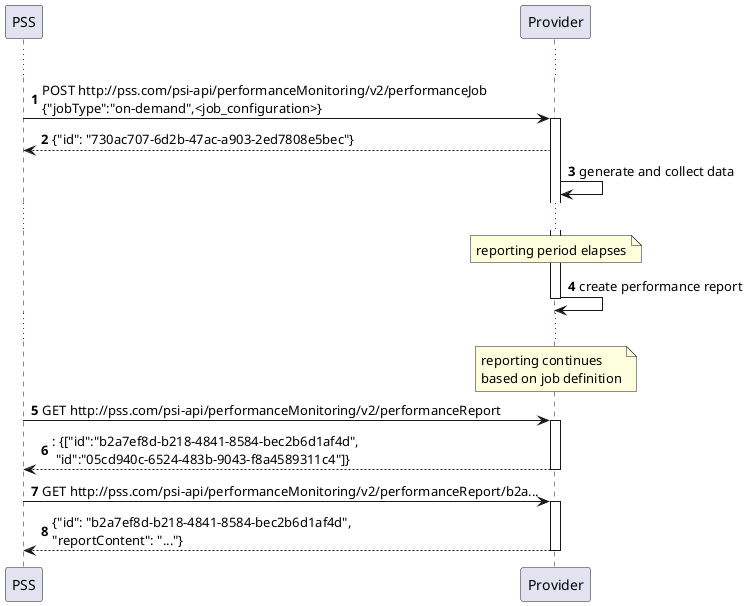
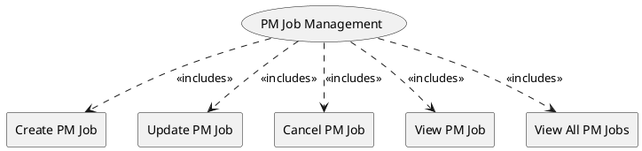

=begin

# TOD-06-04-Performance_Monitoring_Job_Management

> The heading has to be included in the document including this document.

=end

The Performance Monitoring Job Management task takes care of the maintenance of PM jobs in the PSS.

The performance monitoring job is responsible for provisioning appropriate measurement points, and performance objectives, together with measurement intervals and schedules, to measure applicable KPIs/KQIs specific to the service and defined by service level objectives.

Performance monitoring jobs are typically associated with an SLS but can be used for an on-demand performance measurement that is initiated for a limited time, typically a single run or non-continuous run, to carry out the performance measurement tests and support troubleshooting during service assurance.
Management of a performance monitoring job is depicted in the following diagram.

{#fig:TOD-06-04-Performance_Monitoring_Job-sequence}

Operations applicable to the performance monitoring job are listed below.

{#fig:TOD-06-04-Performance_Monitoring_Job_Management}

|                      |  Customer  |  Provider  | Other PSS  | Governance |
|----------------------|:----------:|:----------:|:----------:|:----------:|
| **Create PM Job**    | \checkmark |            | \checkmark |            |
| **Update PM Job**    | \checkmark |            | \checkmark |            |
| **Cancel PM Job**    | \checkmark |            | \checkmark |            |
| **View PM Job**      | \checkmark |            | \checkmark | \checkmark |
| **View All PM Jobs** | \checkmark |            | \checkmark | \checkmark |

Table: Performance Monitoring Job Management Matrix. {#tbl:performance-monitoring-job-management-matrix}

**eTOM Reference**

The task is based on the 1.4.7 process identifier from the eTOM.
