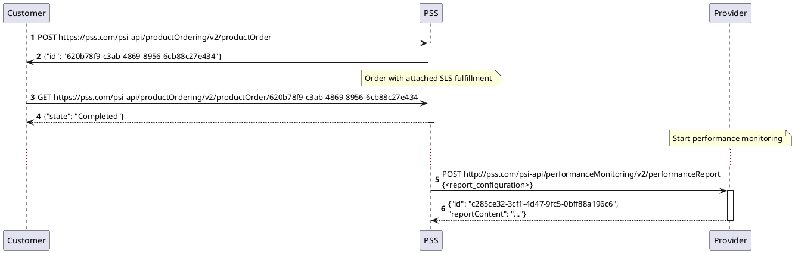
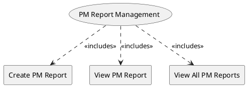

=begin

# TOD-06-05-Performance_Monitoring_Report_Management

> The heading has to be included in the document including this document.

=end

The Performance Monitoring Report Management task takes care of the maintenance of PM reports in the PSS.
Performance Monitoring Reports show data collected by the service provider.
This data can be generated in two ways.
First, when a service with an attached SLS is provisioned, the provider starts collecting performance measurements related to the SLS.
In order to get the performance data, the PSS can request an ad-hoc report creation which is depicted in the diagram below.

{#fig:TOD-06-05-Performance_Monitoring_Report-sequence}

A second option is to create an on-demand Performance Monitoring Job which will collect data and put it in the report (see [TOD-06-04](#tod-06-04-performance_monitoring_job_management)).

Operations available for managing a Performance Monitoring Report are listed in the following diagram.

{#fig:TOD-06-05-Performance_Monitoring_Report_Management}

|                         |  Customer  |  Provider  | Other PSS  | Governance |
|-------------------------|:----------:|:----------:|:----------:|:----------:|
| **Create PM Report**    | \checkmark |            | \checkmark |            |
| **View PM Report**      | \checkmark |            | \checkmark | \checkmark |
| **View All PM Reports** | \checkmark |            | \checkmark | \checkmark |

Table: Performance Monitoring Report Management Matrix. {#tbl:performance-monitoring-report-management-matrix}

**eTOM Reference**

The task is based on the 1.4.7 process identifier from the eTOM.
