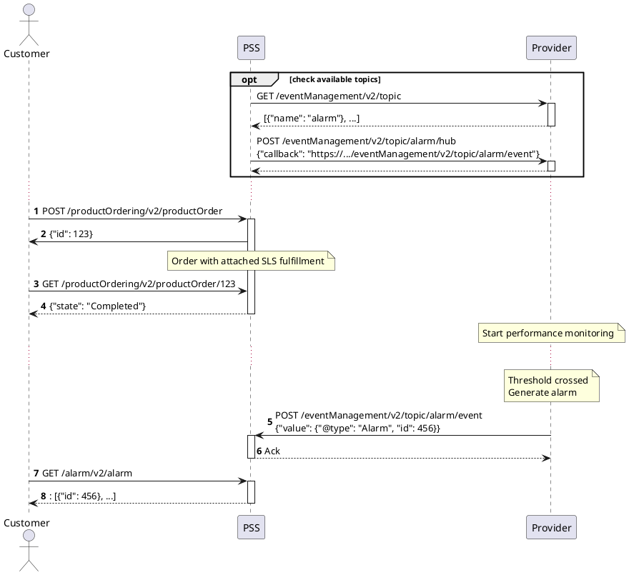
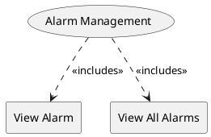

=begin

# TOD-06-06-Alarm_Management

> The heading has to be included in the document including this document.

=end

The Alarm Management task takes care of the maintenance of alarms in the PSS.
Alarms are generated by a service provider as a consequence of crossing thresholds defined by the service level objectives defined for the service (see [TOD-06-01](#tod-06-01-servicelevelobjectivemanagement)).
The following diagram illustrates a typical sequence leading to the creation of an alarm.

{#fig:TOD-06-06-Alarm_Management-seq}

The PSS is subscribing for events related to alarm generation.
This provides a callback address to which service provider should send alarms related to services (see [TOD-01-02](#tod-01-02-eventmanagement)).
When customer of the PSS sends an order for a product with SLS attached, provisioning of the service will also start performance monitoring on the service provider side.
In case service provider detects that service level objective threshold was crossed and the prescribed action requires an alarm, it will generate one.
This will in turn cause creation of a relevant event that will be pushed to PSS with all details of the alarm.

Steps related to alarms are further described in the following operations:

{#fig:TOD-06-06-Alarm_Management}

|                         |  Customer  |  Provider  | Other PSS  | Governance |
|-------------------------|:----------:|:----------:|:----------:|:----------:|
| **View Alarm**          | \checkmark | \checkmark | \checkmark | \checkmark |
| **View All Alarms**     | \checkmark | \checkmark | \checkmark | \checkmark |

Table: Alarm Management Matrix. {#tbl:alarm-management-matrix}

**eTOM Reference**

The task is based on the 1.4.6 and 1.5.8 process identifier from the eTOM.
