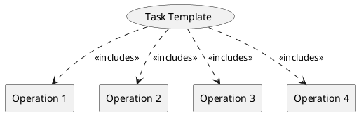

=begin

# TOD-XX-XX-Task_Template

> The heading has to be included in the document including this document

=end

The description of a task starts with the section title stating its ID for reference with four digits (*TOD-XX-XX*) and its name (*Task_Template*).

It is followed by a descriptive text on the task summarizing the business process it covers and giving some hints on the low-level operations that need to be performed to conclude it.
In general, all operations collected under a common task are implemented as REST endpoints either by a provider system or a PSS, that take the role of a server.

The REST endpoints are then invoked by users, the PSS governance, and other PSS-s or providers, that take the role of clients.
The respective interfaces can be deduced based on the involved entities in the service-client relationship.
For example, suppose the PSS is the server that exposes the resource registration operation as a REST endpoint and the provider is the client that uses it to register its resources.
In that case, the "PSS-Provider interface (I/F)" is involved.

The connection between the task and its subsidiary operations is displayed graphically below, while the matrix represents which clients can perform which operation.
Checkmarks in parentheses indicate that these operations are carried out via events (see [TOD-01-02](#tod-01-02-eventmanagement)).
The interfaces covered by the task are graphically represented in the respective sections of the related operations.

=begin

> Delete the description above and insert a description of this particular task.
> Update the table above and the plantuml graphic below.

=end

{#fig:TOD-XX-XX-Task_Template}

|                 |  Customer  |  Provider  |  Other PSS   | Governance |
|-----------------|:----------:|:----------:|:------------:|:----------:|
| **Operation 1** | \checkmark | \checkmark |              |            |
| **Operation 2** | \checkmark | \checkmark |              |            |
| **Operation 3** | \checkmark |            | (\checkmark) |            |
| **Operation 4** | \checkmark |            | (\checkmark) |            |

Table: Task Template Matrix. {#tbl:task-template-matrix}

**Applicable Requirements**

Some tasks have overarching requirements that apply to all operations.
For details, see [PSI-REQ], which follows the same structure as this document for easy reference.

* PSI-XX-XX-00-01
* PSI-XX-XX-00-02
* ...
* PSI-XX-XX-00-NN

=begin

> Delete the text above and include the corresponding auto-generated file following this file's naming:
>
> include [TOD-XX-XX Task Template Requirements](requirements/TOD-XX-XX-Task_Template-requirements.md)

=end

**eTOM Reference**

Most tasks can be mapped to TM Forum's eTOM in one way or another.
Identified processes of eTOM v22.0.0 are linked by the eTOM *Process Identifier*.
For more details about the eTOM processes, please check the eTOM Process Decomposition L3[^eTOM-Decomposition-L3] and L4[^eTOM-Decomposition-L4].

=begin

> Delete the description above and replace with the text below adapted for this task.

The task is based on X.X.X process identifiers from the eTOM v22.0.0.

=end

[^eTOM-Decomposition-L3]: See <https://www.tmforum.org/resources/reference/gb921d-l3-process-decompositions-v22-0-0>  
[^eTOM-Decomposition-L4]: See <https://www.tmforum.org/resources/reference/gb921dx-l4-process-decompositions-v22-0-0>
