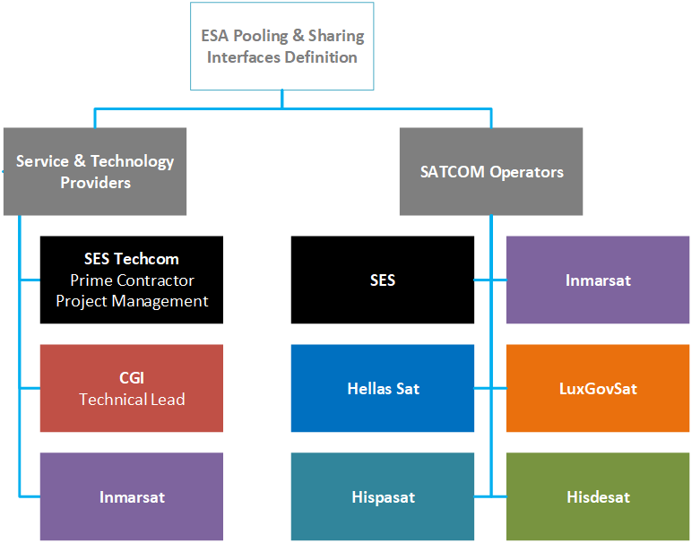

=begin

# Introduction

=end

The Pooling & Sharing Interfaces Definitions (PSID) project is an ESA co-funded effort to define a common standard for the interfaces of Pooling & Sharing Systems (PSS) for Satellite Communication (SatCom) services.
A PSS is a digital platform for matchmaking SatCom users' demands (both commercial and institutional) with SatCom providers' offers.
Bringing together multiple SatCom providers in one platform makes the market transparent, thus allowing users to get an overview of the market and to compare different offers efficiently.
Additionally, a PSS assists users with little knowledge about the SatCom domain defining their requirements on the SatCom services.
Those two aspect combined allow for fast access to the services and an efficient usage of the available capacities.
To accomplish this, a PSS steps in between the usual processes of finding a provider/supplier, requesting an offer, and ordering the desired products or services, either as a service broker or by pooling products and services from different providers and offering them as an intermediary or distributor.
Subsequently, the PSS can be used to monitor the services and manage multiple missions in a single application.

Eventually, a PSS can also be used as (or manage) a community hub, i.e., a number of end users or customers with similar interest that *share* their common resources and utilize a commonly obtained *pool* of SatCom capacities.
This strategy increases the efficient usage of scarce resources further.

There are already different approaches on PSSs, that might lead to an unnecessary fragmentation of the market.
Therefore, a common standard for the interfaces of a PSS is required to allow the interaction between those different PSSs and reduce the effort of SatCom providers to offer their product and services via multiple PSSs to maximize their reach.

Such a standard needs to take care of the different interfaces involved in the aforementioned processes, i.e.,

1. an interface between PSS and resource providers (satellite operators, service providers, or other PSSs),
2. an interface between the PSS and users, and
3. an interface between PSS and its own governance.

The goal of this project is to mainly define aspect 1 and to develop a software mock-up as needed to validate the various interfaces developed.

The PSI standard derives from the existing industry-standard "Open Digital Framework" of **TM Forum** alliance[^1].
The "Open Digital Framework" is a reference framework for delivering online Information, Communications and Entertainment services to the telecom world. 
It empowers market participants to compete and cooperate.
One of PSI's goals is to make this existing standard fit for the world of satellite communication.

The consortium for this project consists of the service & technology providers SES Techcom and CGI, as well as of the SatCom operators SES, Hellas Sat, Hispasat, Hisdesat, and LuxGovSat, and Inmarsat being both a service & technology provider and a SatCom operator.

{#fig:psi_consortium}

[^1]: See https://www.tmforum.org/resources/reference/gb991-tm-forums-core-concepts-and-principles-v22-0-0/
